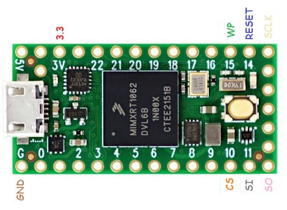

# SPINNER 
## SPI Flasher for the Teensy 4.0


### DEV Setup
To build source currently only Linux has been tested, you can use WSL/2 if you are one Windows though.
- ```sudo apt install gcc-arm-none-eabi```
- ```cd ./SPINNER```
- ```make```
- Use the TeensyLoader to program the HEX file in ```./Release``` to your Teensy 4.0  

### HW Setup


### How to use
- ```python ./spinner.py COM4 info```
- ```python ./spinner.py /dev/ttyUSB0 dump ./flash.bin```
- ```python ./spinner.py COM4 vwrite ./flash.bin```


  *Python 2.7 is no supported :-)*
  
  *Python 3.8 was tested*


### Special Thanks!
- Judges
- Zecoxao


### TODO
- Support more Flash chips
- Add test command to check signal integrity
- Cleaner data transfer methods
- Reliability (error handling)
